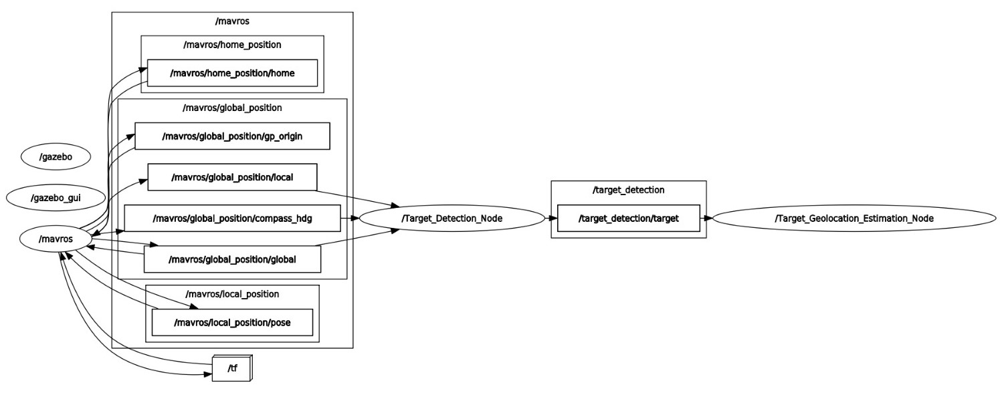
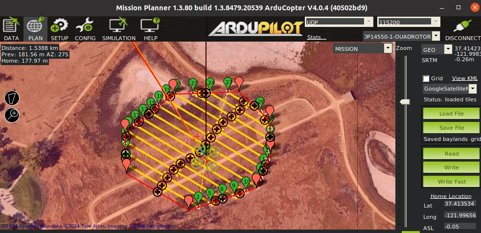
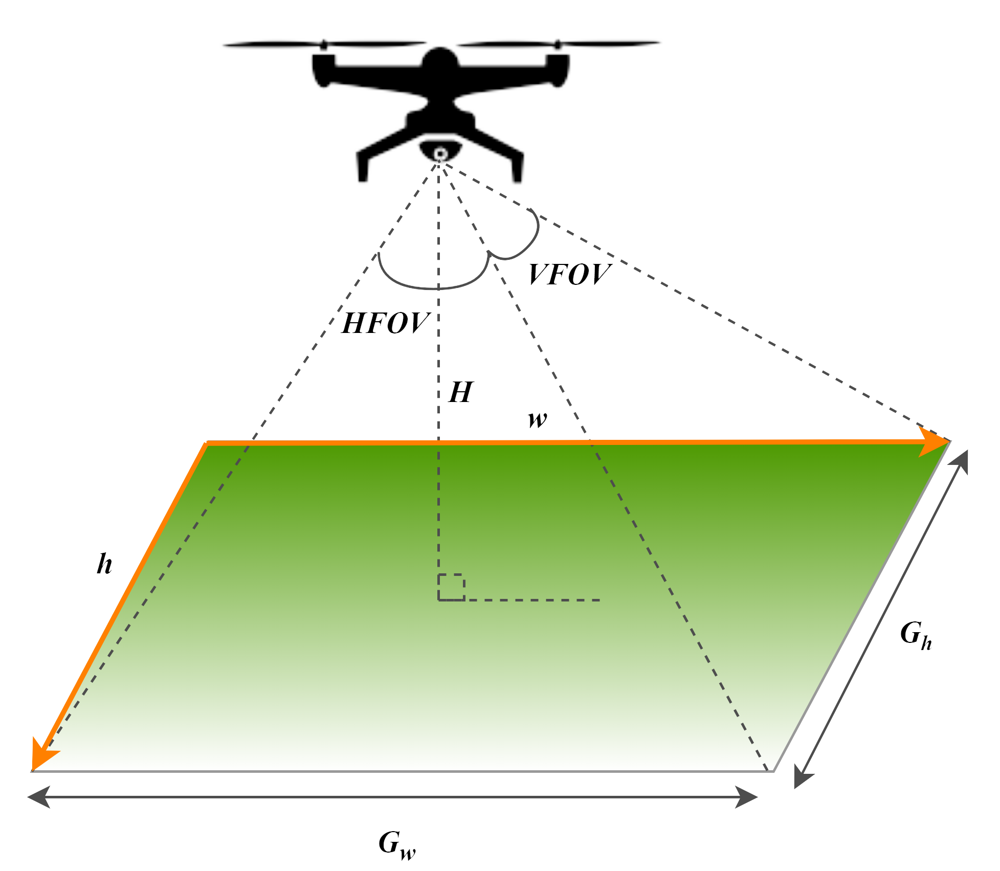
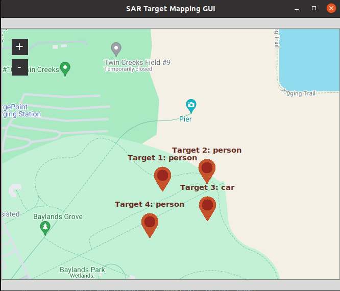
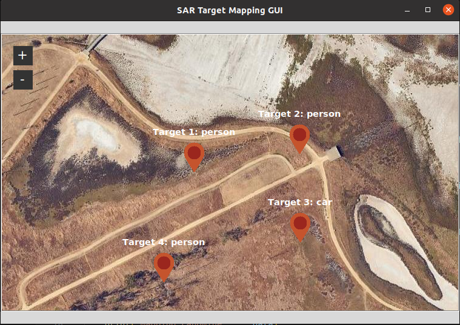
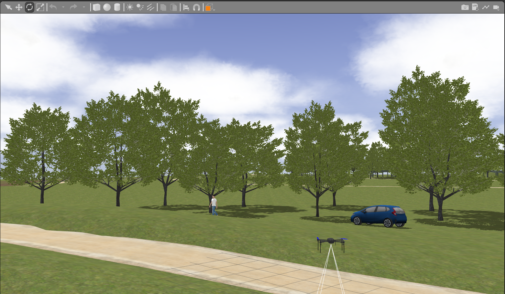
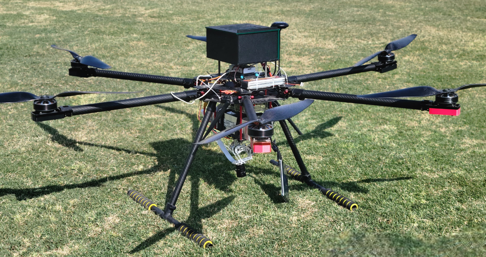

# 🛰️ Autonomous UAV for Target Detection & Mapping in Remote Sensing and SAR Operations

Unmanned Aerial Vehicles (UAVs) have demonstrated immense potential in **remote sensing** and **Search and Rescue (SAR)** operations due to their agility and high-resolution data acquisition capabilities. However, most existing UAV-based SAR systems rely on **manual control** or **offline photogrammetry**, which require extensive post-processing, large datasets, and human supervision — making them inefficient for **time-critical rescue missions**.

This project presents a **ROS-based autonomous UAV framework** capable of **real-time target detection, localization, and mapping** during autonomous flight missions. The proposed system integrates **ArduPilot SITL**, **MAVROS**, and **Gazebo simulation** to simulate a complete end-to-end SAR workflow. Using a **lightweight MobileNet SSD model** deployed on an onboard **NVIDIA Jetson Nano**, the UAV can identify targets in real-time, estimate their **GPS coordinates**, and visualize their positions both **online (live mapping)** and **offline (post-mission)**. The framework aims to make **autonomous remote sensing and SAR operations more accessible, efficient, and deployable on low-cost UAV hardware**.

This work has been developed as part of a **funded research project** under the **National Center of GIS and Space Applications (NCGSA)** at the **Intelligent Mobile Robotics Lab**, KIET.

---

## ⚙️ System Architecture

The proposed system architecture is divided into four key modules — each handling a distinct aspect of the autonomous mission:  
**(1) Mission Planning**, **(2) Target Detection**, **(3) Target Geolocation Estimation**, and **(4) Target Mapping**.



### ✈️ Mission Planning and Autonomous Execution

The **mission planning module** enables the UAV to perform fully autonomous flight operations over predefined GPS waypoints.  
Using **ArduPilot SITL** integrated with **MAVROS**, the UAV performs:
- **Autonomous takeoff**,  
- **Grid-based waypoint navigation**, and  
- **Automatic return-to-home** once the mission completes.

Flight paths can be created using standard GCS tools such as **Mission Planner** or **QGroundControl**, and are uploaded to the UAV before the mission.  
During flight, the UAV continuously publishes telemetry, camera data, and GPS readings through ROS topics for further processing.



### 🧠 Target Detection and Identification Algorithm

The **Target Detection Node** is responsible for identifying persons, vehicles, or other relevant objects during flight using an onboard **MobileNet SSD** network.  
This deep learning model, optimized with **TensorRT**, allows for **near real-time inference (~30 FPS)** on the **Jetson Nano**, making it highly suitable for onboard deployment.  
Key advantages include:
- **Low computational footprint**, ensuring extended flight time.  
- **High detection rate (~70%)** even on pretrained weights.  
- Capability to differentiate between **object categories** (e.g., human, car).  

Detections are continuously published as ROS messages, which are then processed by the geolocation module for mapping.

### 📍 Target Geolocation Estimation

Once a target is detected in the image frame, its **geographic coordinates** are computed using the UAV’s:
- GPS position,  
- Altitude above ground,  
- Camera intrinsic parameters (resolution, FOV), and  
- UAV heading (yaw).

The detected target’s pixel coordinates are transformed into **North–East world coordinates** and then into **latitude–longitude** using a spherical Earth model.  
The algorithm also:
- **Refines duplicate detections** based on proximity and bounding box confidence,  
- **Averages multiple observations** for accuracy improvement, and  
- Publishes results in real-time to a ROS topic (`/target_detection/target`).

This results in an **average localization accuracy of 2.63 m in simulation** and **3.35 m during field testing**.



### 🗺️ Target Mapping

The **mapping module** provides both **real-time** and **offline** visualization of detected targets using the **TkinterMapView** library.  
- During flight, detected targets are displayed as labeled pins on an interactive **Google Maps** or **Satellite view**.  
- If real-time connectivity with the UAV is unavailable, the system can generate **offline maps** using saved log files.  

This feature enables rescue teams to analyze search areas efficiently, make quick decisions, and replay missions for data validation.

 

---

## 🚀 Implementation Overview

| Module | Function |
|---------|-----------|
| **Mission Planning** | Grid-based autonomous navigation using ArduPilot SITL and MAVROS. |
| **Target Detection** | Real-time detection using MobileNet SSD (TensorRT-optimized). |
| **Geolocation Estimation** | Transforms image-frame detections into global GPS coordinates. |
| **Target Mapping GUI** | Displays detected targets on interactive map (Google Maps / Satellite). |
| **ROS Communication Layer** | Handles UAV–base-station message exchange over ROS topics. |

---

## 🧩 Repository Structure

Directory structure:

```
└── fabeha-raheel-remote-sensing-mapping-uav/
    ├── README.md
    ├── CMakeLists.txt
    ├── package.xml
    ├── extras/ # Waypoints, mission boundaries, and test data
    ├── include/ # Label files (COCO classes, etc.)
    ├── launch/ # ROS launch files for simulation and testing
    ├── logs/ # Data logs for offline mapping
    ├── models/ # Gazebo models (drones, environments, etc.)
    ├── msg/ # Custom ROS message (Target.msg)
    ├── results/ # Test results and output coordinates
    ├── scripts/ # Core Python nodes and utilities
    │ ├── mnssd_detection.py
    │ ├── target_localization.py
    │ ├── target_mapping.py
    │ ├── tk_mapping_node.py
    │ ├── offline_mapping.py
    │ └── ...
    └── worlds/ # Gazebo worlds for simulation
```


---

## ⚙️ Prerequisites

Tested on **Ubuntu 20.04 LTS**  
- **ROS Distribution:** ROS Noetic  
- **Flight Stack:** ArduPilot SITL  
- **Simulator:** Gazebo  
- **Middleware:** MAVROS  

### Install MAVROS
```bash
sudo apt-get install ros-noetic-mavros ros-noetic-mavros-extras
wget https://raw.githubusercontent.com/mavlink/mavros/master/mavros/scripts/install_geographiclib_datasets.sh
chmod +x install_geographiclib_datasets.sh
./install_geographiclib_datasets.sh
```

### Install Python Dependencies

```bash
pip install opencv-python imutils pillow numpy tkintermapview
```

## 🛠️ Setup and Installation

Clone the repository and build the workspace:

```bash
cd ~
mkdir -p sar_ws/src
cd sar_ws/src
git clone https://github.com/fabeha-raheel/fabeha-raheel-remote-sensing-mapping-uav.git
cd ..
catkin_make
source devel/setup.bash
```

## 🚁 Running the Simulation

#### 1. Start ArduPilot SITL:

```bash
cd scripts/
./startsitl.sh
```

#### 2. Launch the simulation world:

```bash
roslaunch fabeha-raheel-remote-sensing-mapping-uav baylands.launch
```



#### 3. Run target detection and localization:

```bash
rosrun fabeha-raheel-remote-sensing-mapping-uav mnssd_detection.py
rosrun fabeha-raheel-remote-sensing-mapping-uav target_localization.py
rosrun fabeha-raheel-remote-sensing-mapping-uav tk_mapping_node.py
```

#### 4. View results:
- Real-time GUI updates detected target coordinates on a map.
- Offline analysis can be performed from ```/logs``` and ```/results```.

---

## 🧩 Hardware Platform




| Component | Specification |
|------------|----------------|
| **Frame** | ZD1250 Hexacopter Frame |
| **Motors & Props** | Gartt ML5008 400KV BLDC + 20″ Carbon Props |
| **Flight Controller** | Pixhawk Cube Orange (ArduCopter Firmware) |
| **Companion Computer** | NVIDIA Jetson Nano (with TensorRT) |
| **Camera** | Sony IMX477 (Downward Facing RGB Sensor) |
| **Telemetry** | Herelink HD Video + Control Link (10 km range) |
| **Flight Time** | ≈ 20 minutes |
| **Payload Capacity** | ≈ 1 kg |

---

## 🧭 Results & Performance

| Metric | Simulation | Real-world Test |
|---------|-------------|----------------|
| **Detection Accuracy** | ~70.2 % | ~81.0 % |
| **Localization Accuracy** | 2.63 m | 3.35 m |
| **Processing Time per Frame** | 406 ms | 406 ms |
| **Inference Speed** | - | ~30 FPS on Jetson Nano |

The system successfully detected and localized all test targets (humans and vehicles) and mapped their coordinates accurately, demonstrating strong potential for **time-critical SAR operations**.

---

## 🎥 Video Demonstration

---

## 📘 Citation

If you use this work in your research, please cite:

> Mehmood, H., Raheel, F., Kadri, M. B., & Khan, U. S. (2024, December). Autonomous Detection and Geolocalization of Targets Using Unmanned Aerial Vehicles for Search and Rescue (SAR) Operations. In 2024 International Conference on Robotics and Automation in Industry (ICRAI) (pp. 1-6). IEEE.

```
@inproceedings{mehmood2024autonomous,
  title={Autonomous Detection and Geolocalization of Targets Using Unmanned Aerial Vehicles for Search and Rescue (SAR) Operations},
  author={Mehmood, Hassan and Raheel, Fabeha and Kadri, Muhammad Bilal and Khan, Umar Shahbaz},
  booktitle={2024 International Conference on Robotics and Automation in Industry (ICRAI)},
  pages={1--6},
  year={2024},
  organization={IEEE}
}
```

---

## 💰 Funding Acknowledgment

This project was funded under the **National Center of GIS and Space Applications (NCGSA)**, titled:

> _“High Precision Location Identification for Multiple Applications using Deep Neural Networks by Augmenting GPS with Terrain Knowledge.”_  
> Total funding: **PKR 12.48 million (≈ USD $70 K)**

---

## 🌍 Authors

**Muhammad Bilal Kadri** - Principal Investigator | Director, Intelligent Mobile Robotics Lab
🔗 [LinkedIn](https://sa.linkedin.com/in/muhammad-bilal-kadri-phd-277b3811)

**Hassan Mehmood** — UAV Expert | Project Lead 
🔗 [LinkedIn](https://www.linkedin.com/in/hassan-mehmood1/) • [GitHub](https://github.com/hassan-mehmood1)

**Fabeha Raheel** — Robotics Engineer | Autonomous Systems Researcher  
🔗 [LinkedIn](https://www.linkedin.com/in/fabeha-raheel) • [GitHub](https://github.com/fabeha-raheel)

---

---

## Additional Details

Baylands model is larger than Github's limit. Download it from the following link: http://models.gazebosim.org/baylands/

### Edit Baylands Location in ArduPilot SITL
```bash
gedit ~/ardupilot/Tools/autotest/locations.txt
```

Add the following location at the end of the file:
```
Baylands=37.413534,-121.996561,0,0
```

